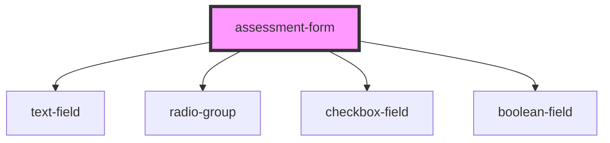

# assessment-form

<!-- Auto Generated Below -->

## Properties

| Property         | Attribute | Description | Type             | Default     |
| ---------------- | --------- | ----------- | ---------------- | ----------- |
| `assessmentData` | --        |             | `AssessmentData` | `undefined` |

## Events

| Event        | Description | Type               |
| ------------ | ----------- | ------------------ |
| `completion` |             | `CustomEvent<any>` |
| `pageChange` |             | `CustomEvent<any>` |

## Dependencies

### Depends on

- [text-field](./sub-components/text-field)
- [radio-group](./sub-components/radio-group)
- [checkbox-field](./sub-components/checkbox-field)
- [boolean-field](./sub-components/boolean-field)

### Graph

----------------------------------------------

*Built with [StencilJS](https://stenciljs.com/)*
