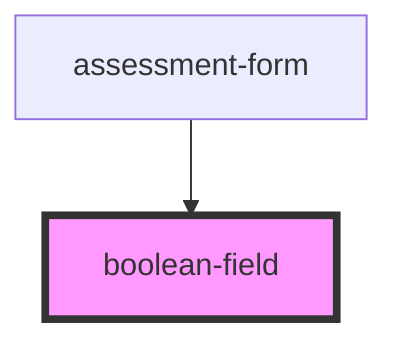

# boolean-field

<!-- Auto Generated Below -->

## Properties

| Property        | Attribute        | Description | Type      | Default     |
| --------------- | ---------------- | ----------- | --------- | ----------- |
| `isRequired`    | `is-required`    |             | `boolean` | `undefined` |
| `labelFalse`    | `label-false`    |             | `string`  | `undefined` |
| `labelTrue`     | `label-true`     |             | `string`  | `undefined` |
| `name`          | `name`           |             | `string`  | `undefined` |
| `questionTitle` | `question-title` |             | `string`  | `undefined` |
| `value`         | `value`          |             | `boolean` | `undefined` |

## Events

| Event         | Description | Type               |
| ------------- | ----------- | ------------------ |
| `valueChange` |             | `CustomEvent<any>` |

## Dependencies

### Used by

 - [assessment-form](../..)

### Graph

----------------------------------------------

*Built with [StencilJS](https://stenciljs.com/)*
