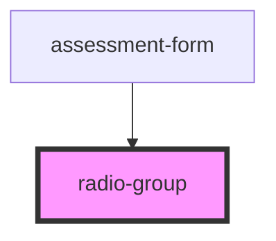

# radio-group

<!-- Auto Generated Below -->

## Properties

| Property        | Attribute        | Description | Type       | Default     |
| --------------- | ---------------- | ----------- | ---------- | ----------- |
| `choices`       | --               |             | `string[]` | `undefined` |
| `errorMessage`  | `error-message`  |             | `string`   | `undefined` |
| `name`          | `name`           |             | `string`   | `undefined` |
| `questionTitle` | `question-title` |             | `string`   | `undefined` |
| `value`         | `value`          |             | `string`   | `undefined` |

## Events

| Event         | Description | Type               |
| ------------- | ----------- | ------------------ |
| `valueChange` |             | `CustomEvent<any>` |

## Dependencies

### Used by

 - [assessment-form](../..)

### Graph

----------------------------------------------

*Built with [StencilJS](https://stenciljs.com/)*
